# Final Project of the Course Node.js and Express.js Apps Development from the IBM Full-Stack Developer Certification Program

In this final project, we will build a server-side online book review application and integrate it with a secure **REST API server**,
which will use authentication at the session level using JWT. You will then test your application using **Promises callbacks** or
**Async-Await functions**.

## Objectives:

After completing this lab, you will be able to:

1. Create APIs and perform CRUD operations on an Express server using Session & JWT authentication.
2. Use Async/Await or Promises with Axios in Node.js.
3. Create REST API endpoints and test them using Postman.

## Understanding the user routes

Navigate to the router directory having the below 3 files:

1. **booksdb.js** - This contains the the preloaded book information for this application.
2. **general.js** - This contains the skeletal implementations for the routes which a general user can access.
3. **auth_users.js** - This contains the skeletal implementations for the routes which an authorized user can access.

### Task 1: 
- Complete the code for getting the list of books available in the shop under public_users.get('/',function (req, res) {.
- Run npm install for installing the required modules & start the server.
- Test the output on Postman.

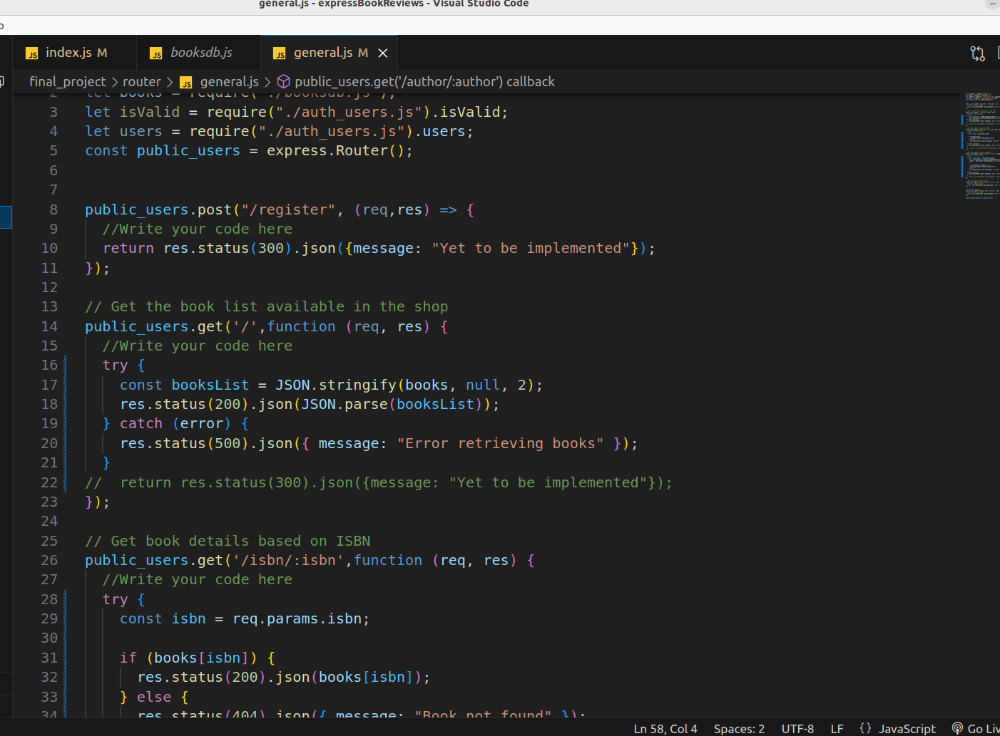

### Task 2:

- Complete the code for getting the book details based on ISBN under public_users.get('/isbn/:isbn',function (req,
res) {.

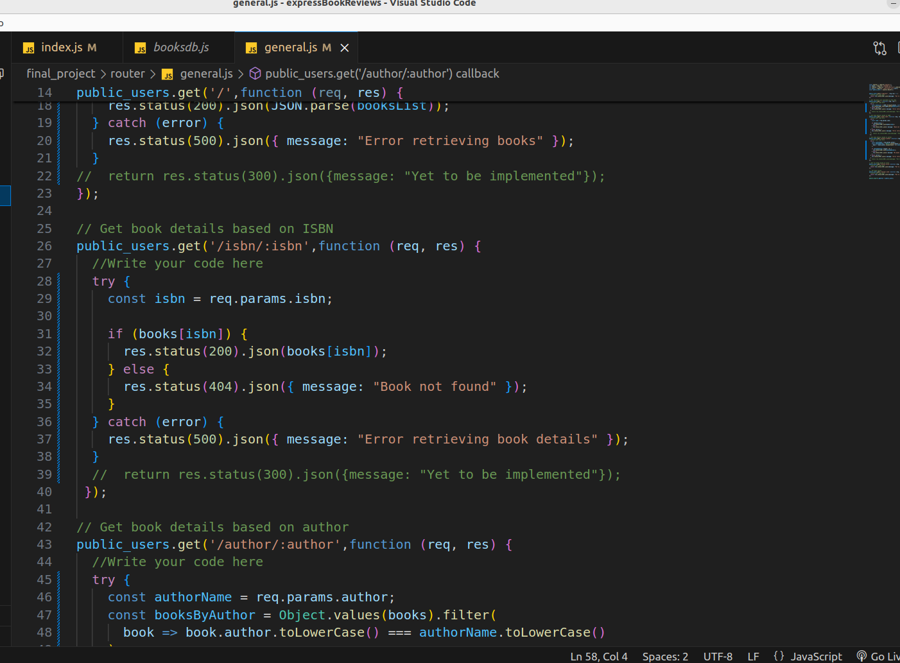

### Task 3:

- Complete the code for getting the book details based on the author under public_users.get('/author/:author',function
(req, res) {.

1. Obtain all the keys for the ‘books’ object.
2. Iterate through the ‘books’ array & check the author matches the one provided in the request parameters.
3. Test the output on Postman.

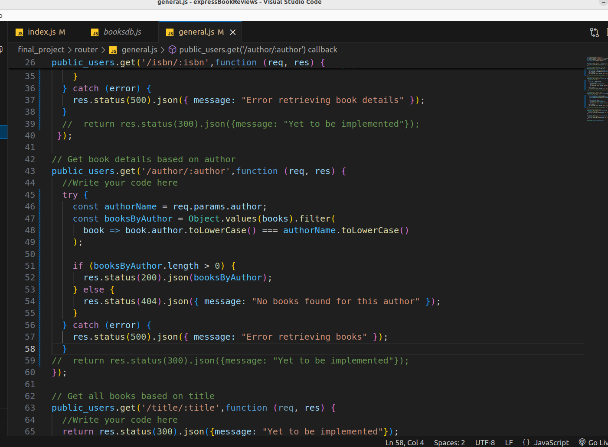

### Task 4:

- Complete the code for getting the book details based on the title under public_users.get('/title/:title',function (req,
res) {.
- Test the output on Postman.

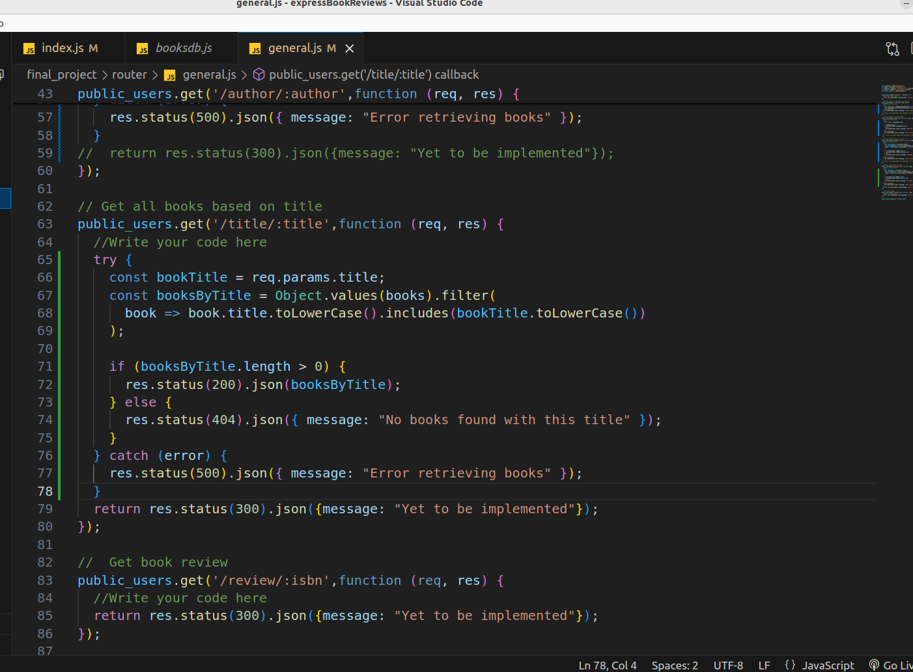

### Task 5

 - Complete the code for getting book reviews under public_users.get('/review/:isbn',function (req, res) {.

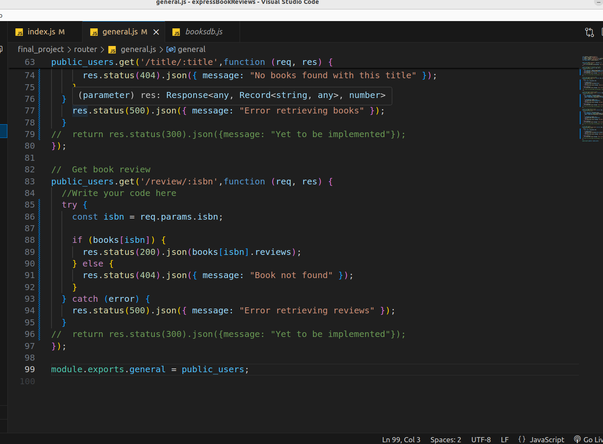

### Task 6

- Complete the code for registering a new user
- The code should take the ‘username’ and ‘password’ provided in the body of the request for registration. If the username already exists, it must mention the same & must also show other errors like eg. when username &/ password are not provided.
- Test the output on Postman.

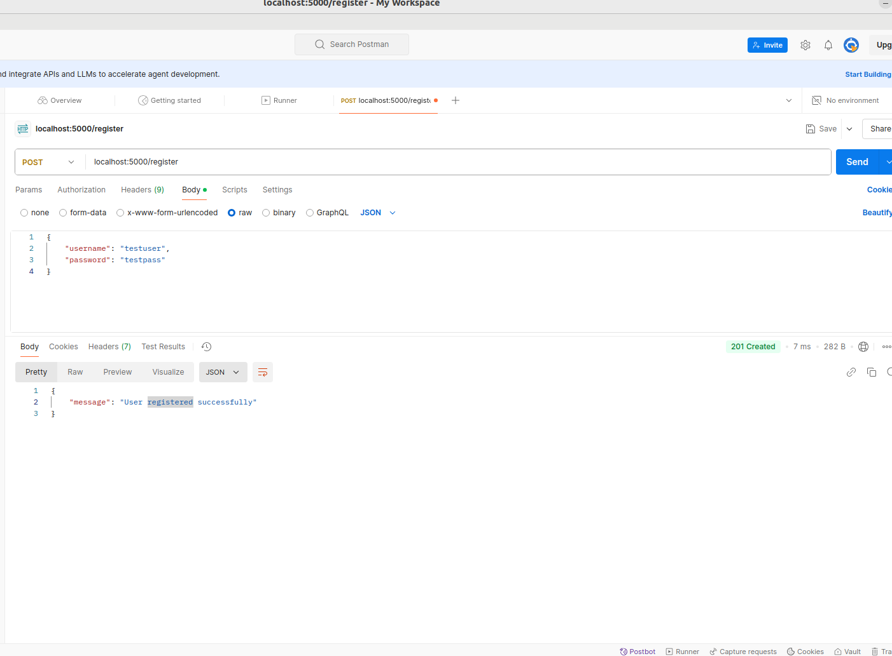

### Task 7

- Complete the code for logging in as a registered user.
-  The code must validate and sign in a customer based on the username and password created in Exercise 6. It must also save the user credentials for the session as a JWT.
- As you are required to login as a customer, while testing the output on Postman, use the endpoint as "customer/login"
- Test the output on Postman.

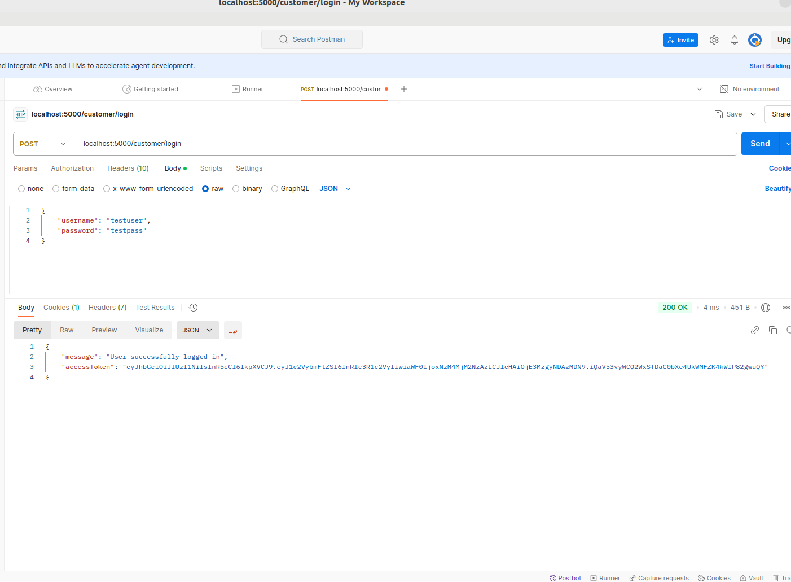

### Task 8

- Complete the code for adding or modifying a book review.
- You have to give a review as a request query & it must get posted with the username (stored in the session) posted. If the same user posts a different review on the same ISBN, it should modify the existing review. If another user logs in and posts a review on the same ISBN, it will get added as a different review under the same ISBN.
- Test the output on Postman.

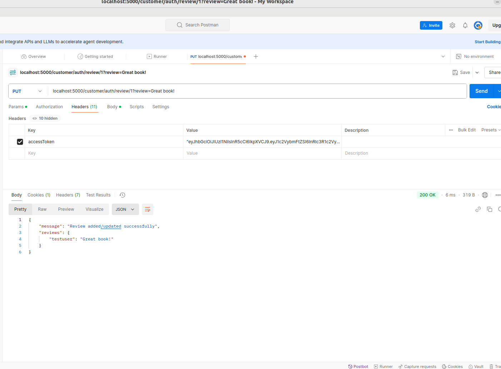

### Task 9

- Complete the code for deleting a book review under regd_users.delete("/auth/review/:isbn", (req, res) => {
- Filter & delete the reviews based on the session username, so that a user can delete only his/her reviews and not other users’.
- Test the output on Postman.
- With this you have implemented and tested the codes for the general and authenticated user routes.

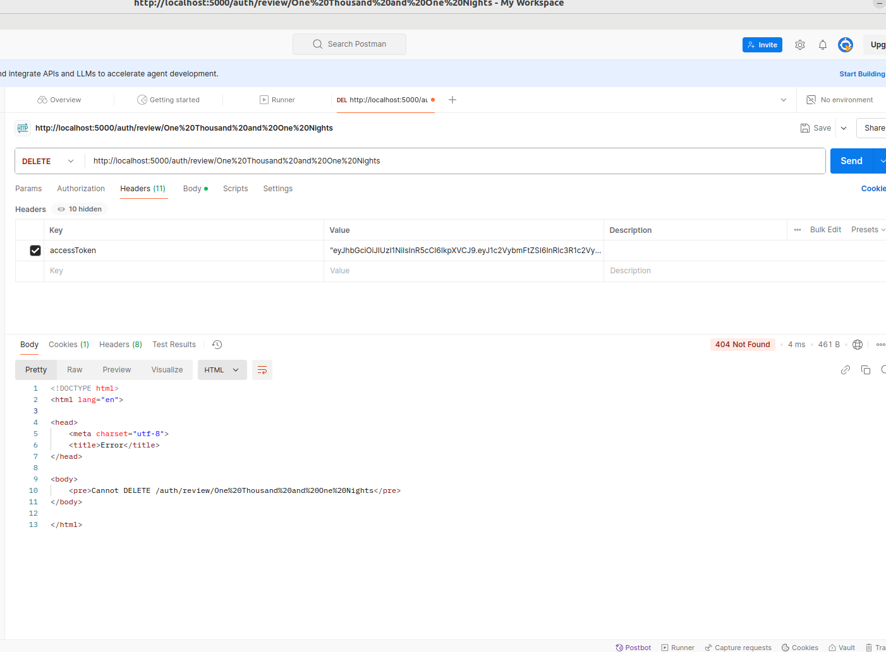

## Improving the scope of Tasks 1-4 using Promises or Async-
Await

### Task 10

- Add the code for getting the list of books available in the shop (done in Task 1) using Promise callbacks or async-await with Axios.
- Please ensure that the general.js file has the code for getting the list of books available in the shop using Promise callbacks or async-await with Axios is covered.

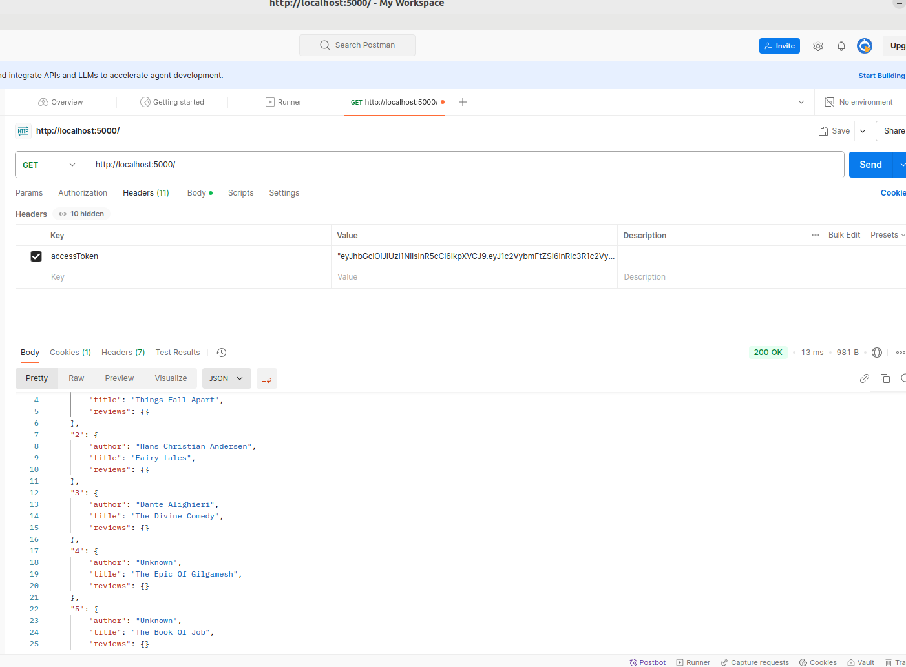

### Task 11

- Add the code for getting the book details based on ISBN (done in Task 2) using Promise callbacks or async-await with Axios.
- Refer to Promises and Callbacks.
- Please ensure that the general.js file has the code for getting the book details based on ISBN using Promise callbacks or async-await with Axios is covered.

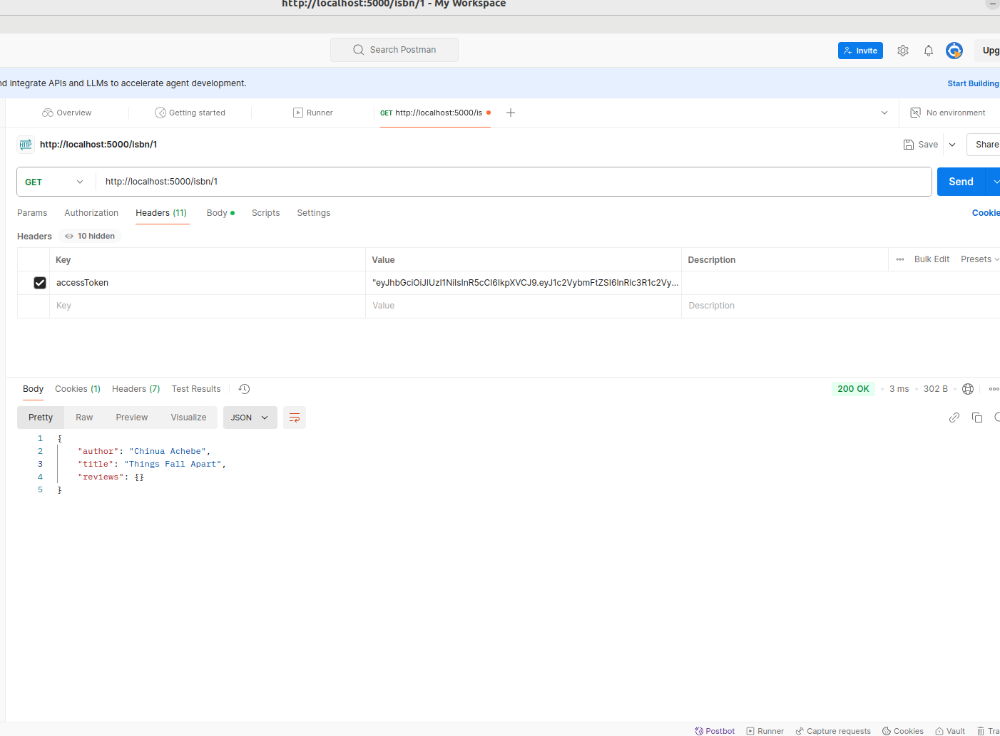

### Task 12

- Add the code for getting the book details based on Author (done in Task 3) using Promise callbacks or async-await with Axios.
- Please ensure that the general.js file has the code for or getting the book details based on Author using Promise callbacks or async-await with Axios is covered.

### Task 13

- Add the code for getting the book details based on Title (done in Task 4) using Promise callbacks or async-await with Axios.
- Please ensure that the general.js file has the code for or getting the book details based on Title using Promise callbacks or async-await with Axios is covered.

## Conclusion

A server-side online book review application has been built, integrated it with a secure **REST API** using **JWT** based session level authentication, and tested the built application using Promises callbacks or Async-Await functions.

# Contributor Covenant Code of Conduct

## Our Pledge

We as members, contributors, and leaders pledge to make participation in our
community a harassment-free experience for everyone, regardless of age, body
size, visible or invisible disability, ethnicity, sex characteristics, gender
identity and expression, level of experience, education, socio-economic status,
nationality, personal appearance, race, caste, color, religion, or sexual
identity and orientation.

We pledge to act and interact in ways that contribute to an open, welcoming,
diverse, inclusive, and healthy community.

## Our Standards

Examples of behavior that contributes to a positive environment for our
community include:

* Demonstrating empathy and kindness toward other contributions that are not aligned with this Code of Conduct, and will communicate reasons for moderation decisions when appropriate.

## Scope

This Code of Conduct applies within all community spaces, and also applies when
an individual, or aggression toward or disparagement of classes of individuals.

**Consequence**: A permanent ban from any sort of public interaction within the
community.

## Attribution

This Code of Conduct is adapted from the [Contributor Covenant][homepage],
version 2.1, available at
[https://www.contributor-covenant.org/version/2/1/code_of_conduct.html][v2.1].

Community Impact Guidelines were inspired by
[Mozilla's code of conduct enforcement ladder][Mozilla CoC].

For answers to common questions about this code of conduct, see the FAQ at
[https://www.contributor-covenant.org/faq][FAQ]. Translations are available at
[https://www.contributor-covenant.org/translations][translations].

[homepage]: https://www.contributor-covenant.org
[v2.1]: https://www.contributor-covenant.org/version/2/1/code_of_conduct.html
[Mozilla CoC]: https://github.com/mozilla/diversity
[FAQ]: https://www.contributor-covenant.org/faq
[translations]: https://www.contributor-covenant.org/translations is officially representing the community in public spaces.
Examples of representing our community include using an official e-mail address,
posting via an official social media account, or acting as an appointed
representative at an online or offline event.

## Enforcement

Instances of abusive, harassing, or otherwise unacceptable behavior may be
reported to the community leaders responsible for enforcement at
[INSERT CONTACT METHOD].
All complaints will be reviewed and investigated promptly and fairly.

All community leaders are obligated to respect the privacy and security of the
reporter of any incident.

## Enforcement Guidelines

Community leaders will follow these Community Impact Guidelines in determining
the consequences for any action they deem in violation of this Code of Conduct:

### 1. Correction

**Community Impact**: Use of inappropriate language or other behavior deemed
unprofessional or unwelcome in the community.

**Consequence**: A private, written warning from community leaders, providing
clarity around the nature of the violation and an explanation of why the
behavior was inappropriate. A public apology may be requested.

### 2. Warning

**Community Impact**: A violation through a single incident or series of
actions.

**Consequence**: A warning with consequences for continued behavior. No
interaction with the people involved, including unsolicited interaction with
those enforcing the Code of Conduct, for a specified period of time. This
includes avoiding interactions in community spaces as well as external channels
like social media. Violating these terms may lead to a temporary or permanent
ban.

### 3. Temporary Ban

**Community Impact**: A serious violation of community standards, including
sustained inappropriate behavior.

**Consequence**: A temporary ban from any sort of interaction or public
communication with the community for a specified period of time. No public or
private interaction with the people involved, including unsolicited interaction
with those enforcing the Code of Conduct, is allowed during this period.
Violating these terms may lead to a permanent ban.

### 4. Permanent Ban

**Community Impact**: Demonstrating a pattern of violation of community
standards, including sustained inappropriate behavior, harassment of an
individual people
* Being respectful of differing opinions, viewpoints, and experiences
* Giving and gracefully accepting constructive feedback
* Accepting responsibility and apologizing to those affected by our mistakes,
  and learning from the experience
* Focusing on what is best not just for us as individuals, but for the overall
  community

Examples of unacceptable behavior include:

* The use of sexualized language or imagery, and sexual attention or advances of
  any kind
* Trolling, insulting or derogatory comments, and personal or political attacks
* Public or private harassment
* Publishing others' private information, such as a physical or email address,
  without their explicit permission
* Other conduct which could reasonably be considered inappropriate in a
  professional setting

## Enforcement Responsibilities

Community leaders are responsible for clarifying and enforcing our standards of
acceptable behavior and will take appropriate and fair corrective action in
response to any behavior that they deem inappropriate, threatening, offensive,
or harmful.

Community leaders have the right and responsibility to remove, edit, or reject
comments, commits, code, wiki edits, issues, and other